# Práctica 1

## Ejercicio 1
Partiremos de un archivo binario de 1024 bits, todos ellos con valor 0. Para hacer refencia al mismo voy a supone que se llama input.bin.

### Creación de input.bin

Necesitamos pasar los bits a bytes, una vez lo tenemos usaremos dd para crear el fichero binario.

1024 bits / 8 = 128 bytes
dd if=/dev/zero of=input.bin count=1 bs=128

## Ejercicio 2
Creamos un archivo binario de 1024 bits, todos ellos con valor 0 y en los primeros 40 bits debe haber un 1. Para hacer refencia al mismo voy a supone que se llama input1.bin.

### Creación de input1.bin

Necesitamos pasar los bits a bytes, una vez lo tenemos usaremos dd para crear el fichero binario.

1024 bits / 8 = 128 bytes
dd if=/dev/zero of=input1.bin count=1 bs=128

Ahora lo editamos con gHex para añadir el 1, en mi caso lo añadiré en el 2 byte.

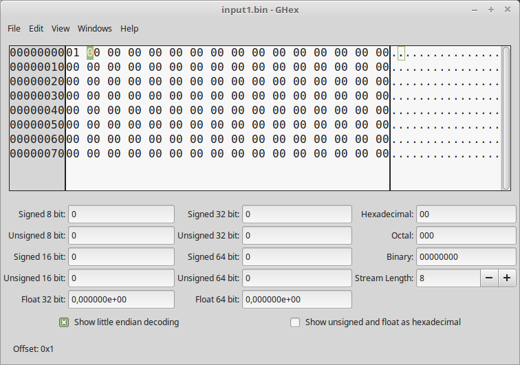

## Ejercicio 3
Cifrad input.bin con DES en modos ECB, CBC, Y OFB, usando como claves una debil y otra semidebil, con vector de inicialización a vuestra elección, explicad los resultados.

Clave debil: 0x0101010101010101
Clave semidebil: 0x01FE01FE01FE01FE

### DES-ECB input.bin

#### DES-ECB input.bin debil
Debemos pasar la clave como parametro en la llamada a openssl, debido a que si no realizará la función hash de la clave introducida.

        openssl enc -des-ecb -in ./input.bin -out ./input.bin.des.ecb.debil -K 0101010101010101

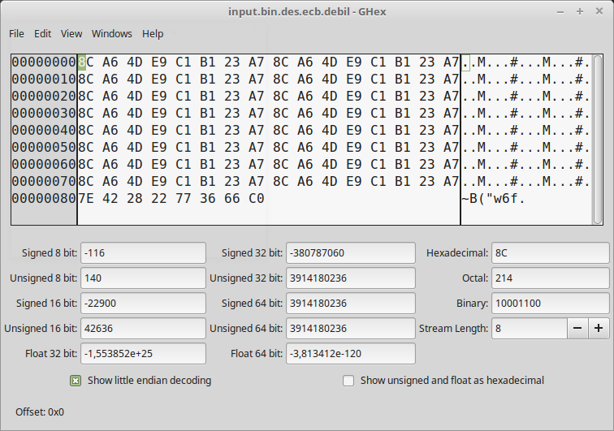

Se puede observar, que se repite en mismo patron desde 0x0 hasta 0x7f.

#### DES-ECB input.bin semidebil

        openssl enc -des-ecb -in ./input.bin -out ./input.bin.des.ecb.semidebil -K 01FE01FE01FE01FE

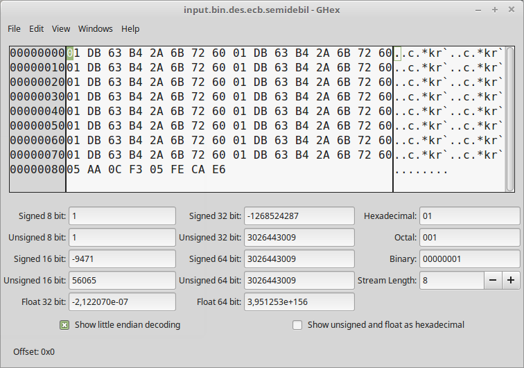

En este caso tambien se repite el mismo patrón, desde el offset 0x0 hasta 0x7f

### DES-CBC input.bin
#### DES-CBC input.bin debil
Vector de inicialización: 0000000000000000

        openssl enc -des-cbc -in ./input.bin -out ./input.bin.des.cbc.debil -K 0101010101010101 -iv 0000000000000000

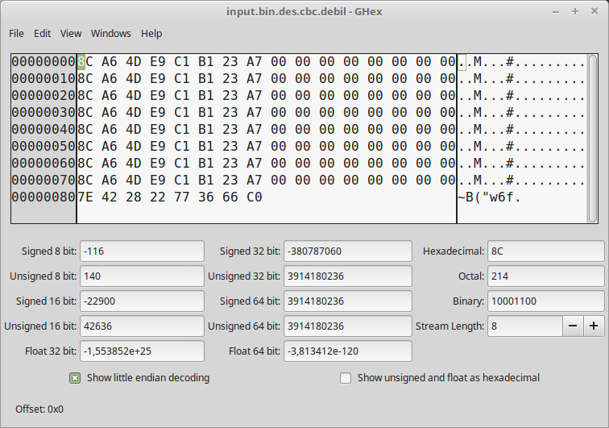

Se puede apreciar, que se repite la misma estructura, pero en este caso en dos bloques distintos de longitud 16 bytes, lo unico que no se repite es de 0x80 a 0x87. En el 2 bloque, vemos que es casi identico a la entrada.

#### DES-CBC input.bin semidebil

Vector de inicialización: 0000000000000000

        openssl enc -des-cbc -in ./input.bin -out ./input.bin.des.cbc.semidebil -K 01FE01FE01FE01F -iv 0000000000000000

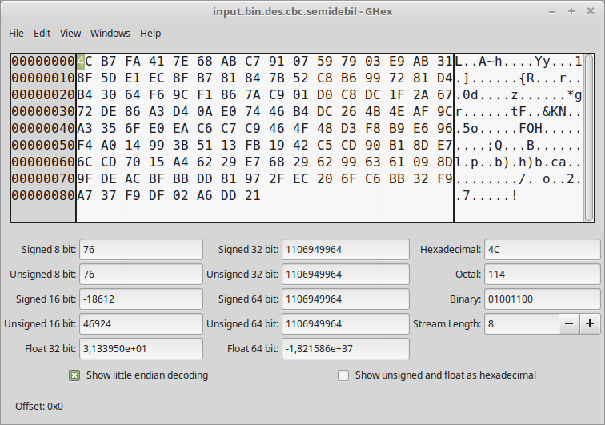

No se observan patrones o repeticiones aparentes.

### DES-OFB input.bin

Para des-ofb necesitamos establecer una clave y su vector de inicialización.

#### DES-OFB input.bin debil

Clave debil: 0101010101010101

Vector inicialización:  0000000000000000

        openssl enc -des-ofb -in ./input.bin -out ./input.bin.des.ofb.debil -K 0101010101010101 -iv 0000000000000000

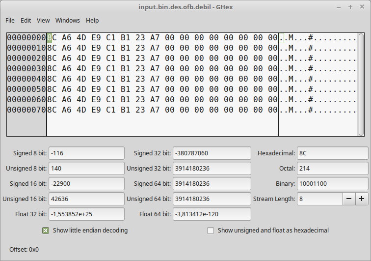

Se puede observar que se repite el mismo patrón para todo el fichero, tambien que la mitad derecha del fichero es igual al fichero de entrada, al igual que 
ocurria con DES-CBC usando clave debil.

#### DES-OFB input.bin semidebil

Clave debil: 01FE01FE01FE01F

Vector inicialización:  0000000000000000

        openssl enc -des-ofb -in ./input.bin -out ./input.bin.des.ofb.semidebil -K 01FE01FE01FE01F -iv 0000000000000000

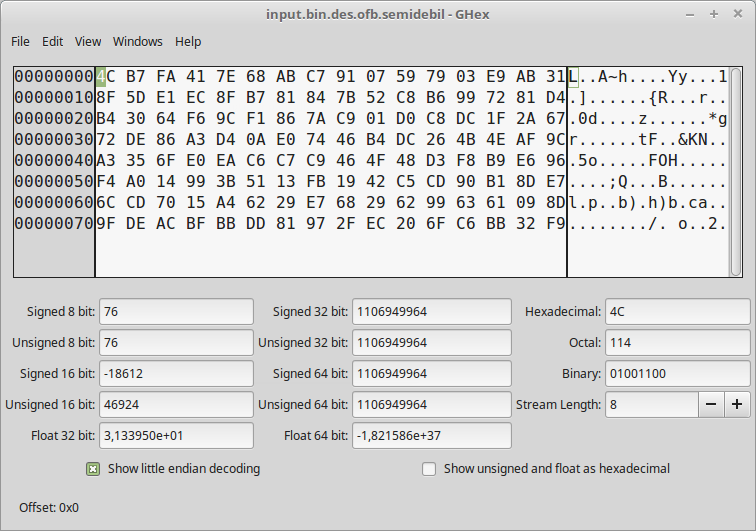

No soy capaz de encontrar patrones aparentes con este modo de cifrado.

## Ejercicio 4

Cifrad input.bin e input1.bin en modo DES-ECB, pero esta vez usando una clave que no sea ni debil ni semidebil, explicad los resultados.

En este caso usaremos una clave que no sea ni debil, ni semidebil como puede ser,

Clave: 045FA982B261C43

### DES-ECB input.bin
Procedemos como en el ejercicio anterior para cifrar con DES-ECB pero en este caso modificando la clave,

        openssl enc -des-ecb -in ./input.bin -out ./input.bin.des.ecb.dificil -K 045FA982B261C43

        openssl enc -des-ecb -in ./input1.bin -out ./input1.bin.des.ecb.dificil -K 045FA982B261C43
        

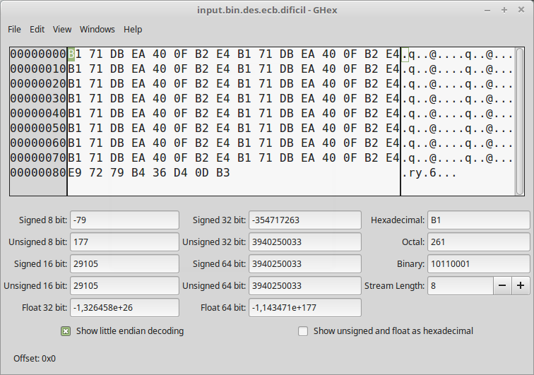
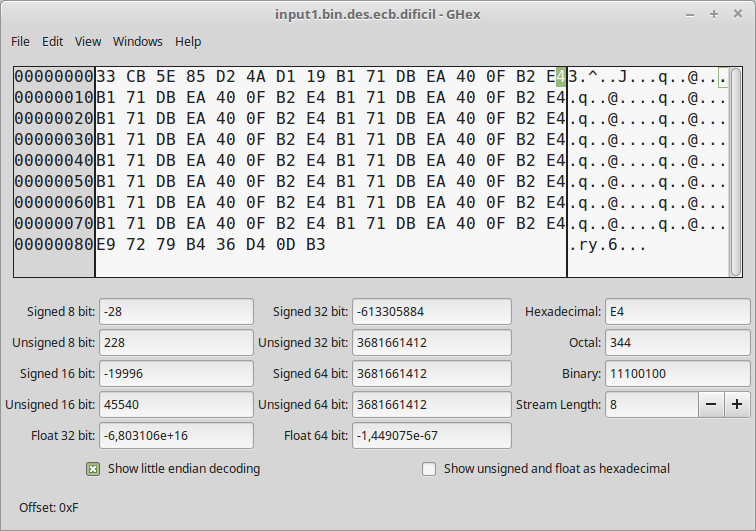

Al igual que nos pasaba en el ejercicio 3 con este modo, somos capaces de observar los patrones del cifrado de bloque de tamaño 0xf

## Ejercicio 5

Cifrad input.bin e input1.bin con DES en modo CBC, con clave y vector de inicialización a elegir. Comparar los resultados con el ejercicio anterior.

Para la clave voy a usar la misma que en el ejercicio anterior y el vector de inicialización todo 0.

Clave: 045FA982B261C43

Vector: 0000000000000000

        openssl enc -des-cbc -in ./input.bin -out ./input.bin.des.cbc.dificil -K 045FA982B261C43 -iv 0000000000000000

        openssl enc -des-cbc -in ./input1.bin -out ./input1.bin.des.cbc.dificil -K 045FA982B261C43 -iv 0000000000000000

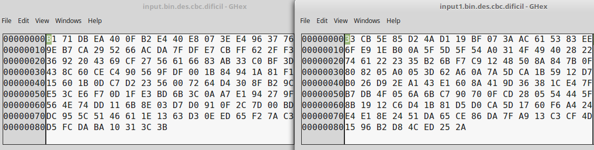

En este caso la primera diferencia es que no se ven los bloques iguales, debido a que uno sirve de entrada del siguiente, por lo que no se ven patrones aparentes.

## Ejercicio 6

Repetid los puntos 5 y 6 con AES-128 y AES-256

### AES-128-ECB

Para este caso usaremos una clave que no sea ni debil, ni semidebil como en el ejercicio anterior,

Clave: 045FA982B261C43

        openssl enc -aes-128-ecb -in ./input.bin -out ./input.bin.aes128.ecb.dificil -K 045FA982B261C43
        openssl enc -aes-128-ecb -in ./input1.bin -out ./input1.bin.aes128.ecb.dificil -K 045FA982B261C43

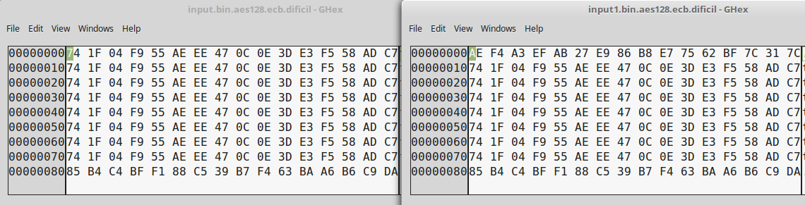

En input.bin se puede ver que todos son iguales excepto la ultima, es decir desde 0x80 hasta 0x8f, debido a la ultima ronda de cifrado.
En input1.bin, ocurre lo mismo y tambien la los primera linea es distinta, debido a que teniamos un 1 en uno de los bits.

### AES-256-ECB

Clave: 045FA982B261C43

        openssl enc -aes-256-ecb -in ./input.bin -out ./input.bin.aes256.ecb.dificil -K 045FA982B261C43
        openssl enc -aes-256-ecb -in ./input1.bin -out ./input1.bin.aes256.ecb.dificil -K 045FA982B261C43

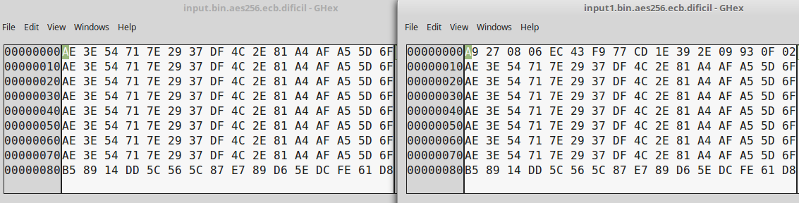

Obtenemos las mismas coincidencias que con AES-128-ECB.

### AES-128-CBC

Clave: 045FA982B261C43
Vector de inicialización: 0000000000000000

        openssl enc -aes-128-cbc -in ./input.bin -out ./input.bin.aes128.cbc.dificil -K 045FA982B261C43 -iv 0000000000000000

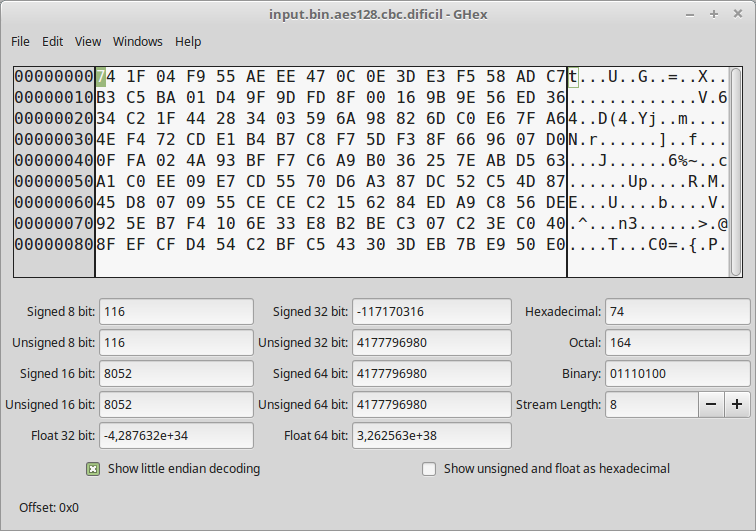

        openssl enc -aes-128-cbc -in ./input1.bin -out ./input1.bin.aes128.cbc.dificil -K 045FA982B261C43 -iv 0000000000000000

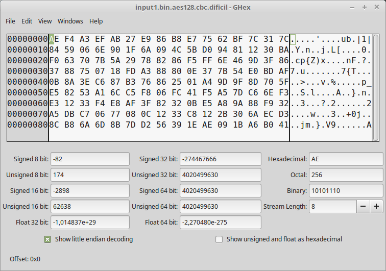

En ambos modos no he sido capaz de encontrar patrones aparentes, o similitudes con los originales.

### AES-256-CBC

Clave: 045FA982B261C43
Vector de inicialización: 0000000000000000

        openssl enc -aes-256-cbc -in ./input.bin -out ./input.bin.aes256.cbc.dificil -K 045FA982B261C43 -iv 0000000000000000

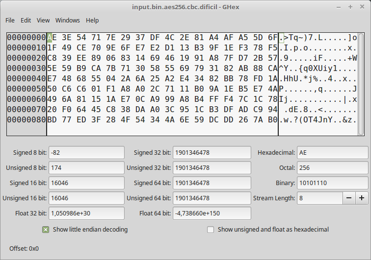

        openssl enc -aes-256-cbc -in ./input1.bin -out ./input1.bin.aes256.cbc.dificil -K 045FA982B261C43 -iv 0000000000000000

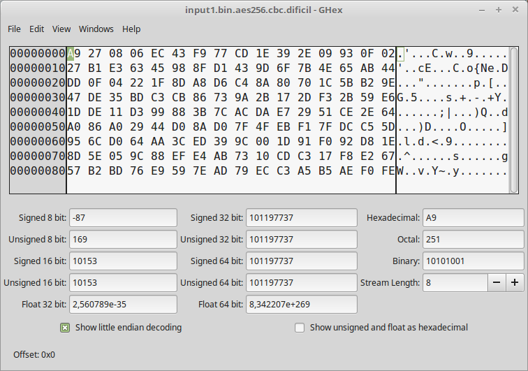

Al igual que en AES128-CBC no he sido capaz de encontrar nada de similitudes.

## Ejercicio 7

Cifrad input.bin con AES-192 en modo OFB, clave y vector de inicialización a elegir, la salida es output.bin.

Clave: 045FA982B261C43
Vector de inicialización: 0000000000000000

        openssl enc -aes-192-ofb -in ./input.bin -out ./output.bin -K 045FA982B261C43 -iv 0000000000000000

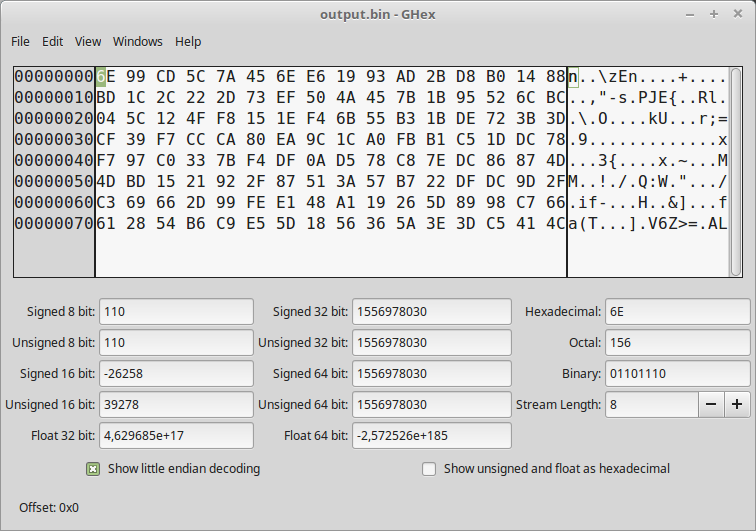

No se ven patrones aparentes al original.

## Ejercicio 8

Desfifra output.bin usando los mismos vectores y claves del ejercicio 7.

Clave: 045FA982B261C43
Vector de inicialización: 0000000000000000

        openssl aes-192-ofb -d -in output.bin -out descifrado.bin -K 045FA982B261C43 -iv 0000000000000000

Como se puede apreciar obtenemos el fichero original input.bin

## Ejercicio 9

Vuelve a cifrar output.bin en modo aes-192-ofb y su mismo vector y claves, explica el resultado.

        openssl enc -aes-192-ofb -in ./output.bin -out ./output2.bin -K 045FA982B261C43 -iv 0000000000000000

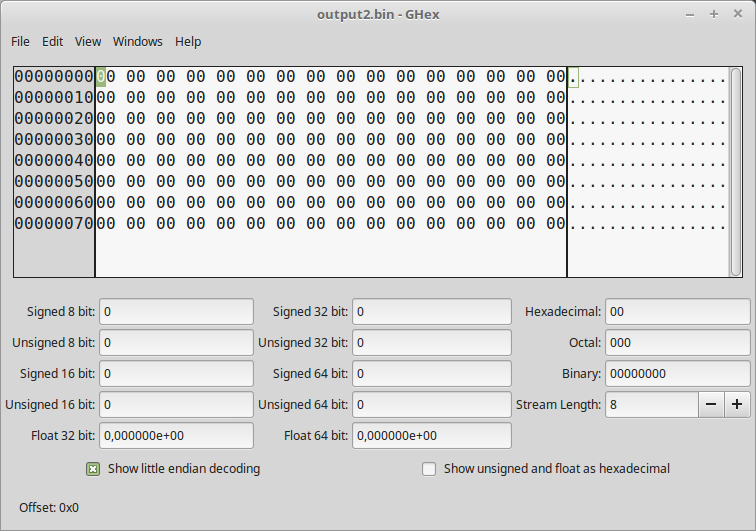

Obtenemos input.bin, cuando se vuelve a cifrar un archivo ya cifrado con la misma clave y vector es como si descifrasemos al ser un algoritmo de cifrado simetrico.

## Ejercicio 10

Presentad otro algoritmo simétrico que aparezca en vuestra implementación de openssl.

He elegido el algoritmo de cifrado Blowfish, es un algoritmo de cifrado simetrico  diseñado por Bruce Schneier en 1993.

Blowfish usa bloques de 64 bits y claves que van desde 32 bits hasta 448 bits, codifica en 16 rondas.

## Ejercicio 11

Realiza los puntos 3 y 5 con el algoritmo anteriormente presentado.

### Cifrado Blowfish en modo ECB

Clave: 045FA982B261C43

        openssl enc -bf-ecb -in input.bin -out input.bin.bf.ecb -K 045FA982B261C43

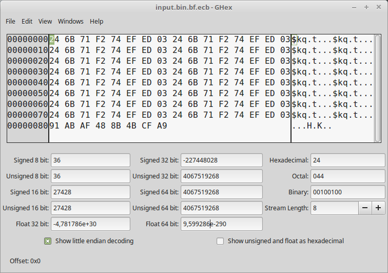

Se puede apreciar que se repiten los patrones las filas, ya que en el fichero original ocurre eso.

        openssl enc -bf-ecb -in input1.bin -out input1.bin.bf.ecb -K 045FA982B261C43

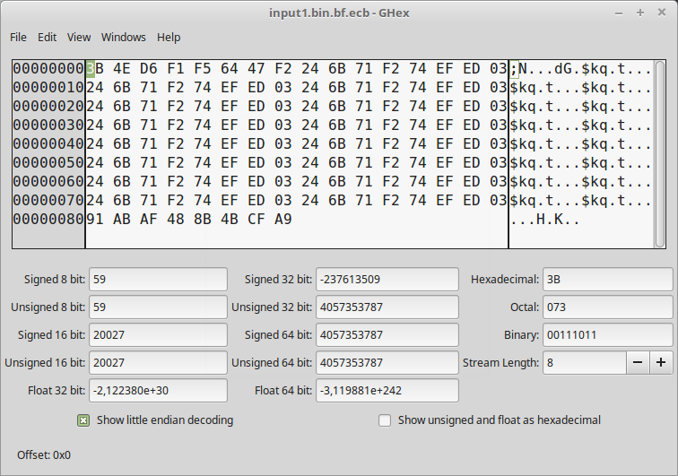

Al igual que en el anterior se repiten los patrones donde toda la fila es 0, pero exceptuando la primera fila, ya que no es igual.

### Cifrado Blowfish en modo CBC

Clave: 045FA982B261C43
Vector de inicialización: 0000000000000000

        openssl enc -bf-cbc -in input.bin -out input.bin.bf.cbc -K 045FA982B261C43 -iv 0000000000000000

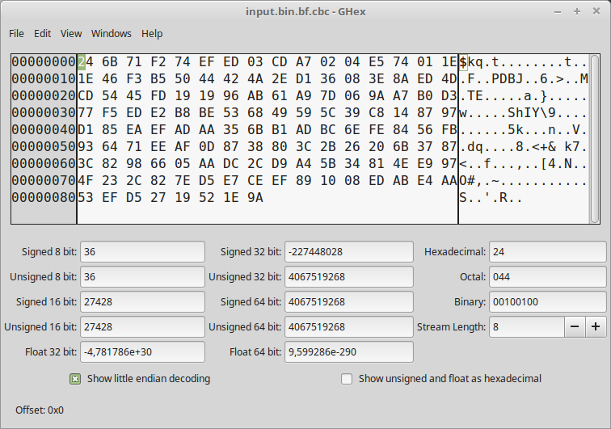

        openssl enc -bf-cbc -in input1.bin -out input1.bin.bf.cbc -K 045FA982B261C43 -iv 0000000000000000

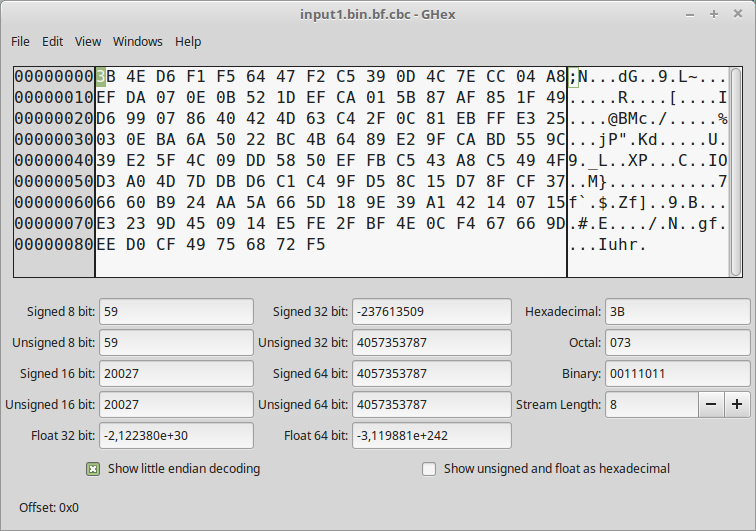

No he sido capaz de encontrar patrones aparentes en ambos ficheros.

