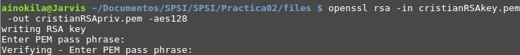
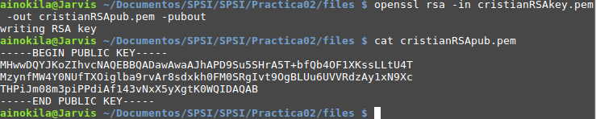

# Práctica 2

## Ejercicio 1
Generad, cadad uno de vosotros, una clave RSA de 768 bits, para referirnos a ella supondre que se llama nombreRSAkey.pem.
No es necesario que este protegida por contraseña.

        openssl genrsa -out cristianRSAkey.pem 768

## Ejercicio 2
Extraed la clave privada contenida en nombreRSAkey.pem a otro archivo llamado nombreRSApriv.pem, este debe estar protegido por contraseña cifrado con AES-128.

Contraseña: 0123456789

El fichero cristianRSAkey.pem ya contiene la clave privada, por lo que no es necesario extraerlo, solo nos queda protegerlo.

        openssl rsa -in cristianRSAkey.pem -out cristianRSApriv.pem -aes128



## Ejercicio 3 
Extraer la clave pública contenida en nombreRSAkey.pem y llamarla nombreRSApub.pem, evidentemente esta clave no debe estar cifrada, mostrar sus valores.

        openssl rsa -in cristianRSAkey.pem -out cristianRSApub.pem



## Ejercicio 4

Reutilizando el fichero input.bin de 1024 bits, todos a 0 de la practica anterior, intenta cifrarlo con la clave pública anteriormente generada.

Para cifrarlo realizariamos:

        openssl rsautl -in input.bin -out input.bin.cifrado -inkey cristianRSApub.pem -pubin 

Pero este fichero es demasiado grande para cifrarlo mediante RSA, por lo que nos genera un error que nos informa.


## Ejercicio 5 

Diseñad un sistema hibrido, con RSA como sistema de cifrado Asimetrico.

```{r, engine='bash', count_lines}

#!/bin/bash

#. /cifrado.sh enc -aes128 publica.pem holi.txt 

if [ "$1" == "enc" ]
then

    #Genero la clave aleatoria para cifra simetrica
    openssl rand -base64 48 -out sessionkey
    echo $2 >> sessionkey

    #Cifro el documento de manera simetrica
    openssl enc $2 -pass file:sessionkey -in $4 -out $4.encrypted

    #Cifro el fichero con la clave random y el tipo de cifrado
    openssl rsautl -encrypt -in sessionkey -out sessionkey.cifrado -inkey $3 -pubin


else

    #. /cifrado.sh dec sessionkey.cifrado privada.pem clave holi.txt.encrypted
   if [ "$1" == "dec" ]
    then


        #Descifro el fichero donde esta contenida la clave aleatoria y el metodo de cifrado
        openssl rsautl -decrypt -inkey $3 -in $2 -out sessionkey -passin pass:$4

        cifrado=$(tail sessionkey -n 1 )
        clave=$(head -n1 sessionkey)
        name=$5
        new_name=${name::-10}


        #Descifro el fichero importante usando la clave y metodo anterior
        openssl enc -d $cifrado -in $5 -pass pass:$clave -out $new_name


        
    else
        echo "Use: ./cifrado.sh enc -type public.pem file"
        echo "Use: ./cifrado.sh dec sessionkey.cifrado private.pem key_private file.encrypted"
    fi
fi

```

## Ejercicio 6
Usando el criptosistema diseñado cifrar y descifrar input.bin

### Cifrado:
Para poder realizar el cifrado necesitamos:
* Clave publica
* Elegir modo simetrico
* Fichero a cifrar

        ./cifrado.sh enc -aes128 cristianRSApub.pem holi.txt 


### Descifrado:
Para poder realizar el descifrado necesitamos:
* Clave privada y contraseña
* Fichero sessionkey.cifrado


        ./cifrado.sh dec sessionkey.cifrado cristianRSApriv.pem 0123456789 holi.txt.encrypted
        


