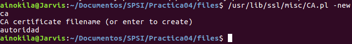
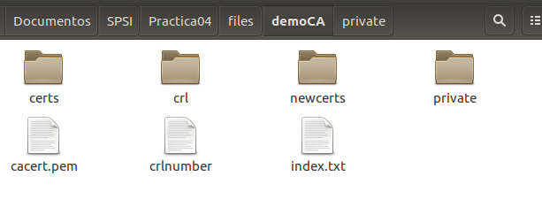
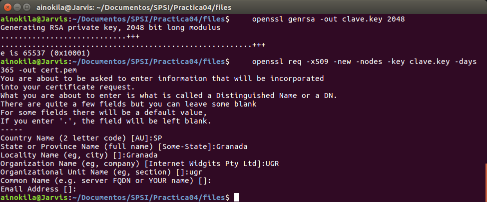
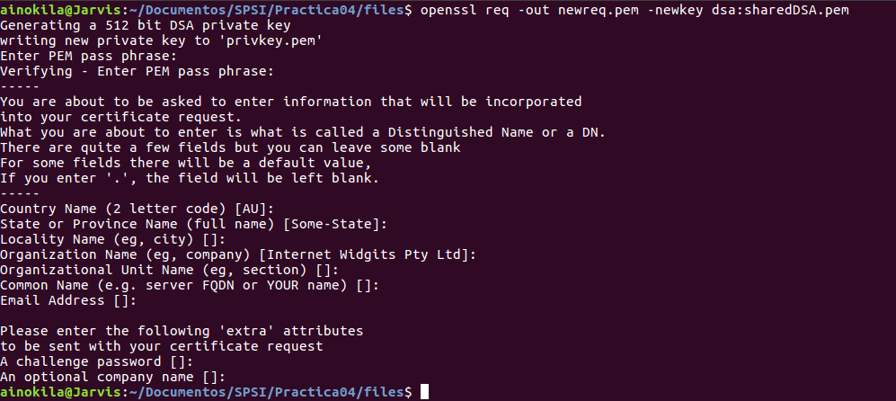
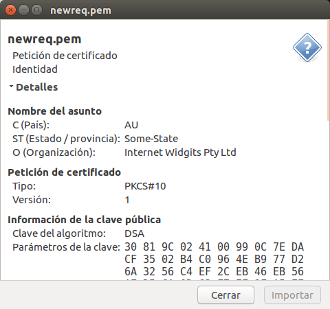

# Práctica 4

## Ejercicio 1

Cread una autoridad certicadora. En este caso se premiar a el uso de openssl ca frente a CA.pl, aunque este último comando es admisible.

Para crear una autoridad certificadora lo podemos realizar de dos maneras, una con el script de CA.pl o mediante la creación de claves y certificado.

En mi caso lo voy a realizar a través del script de CA.pl:

    /usr/lib/ssl/misc/CA.pl -newca

Añadimos el nombre y nos generará un directorio de la CA.

## Ejercicio 2

Cread una solicitud de certicado que incluya la generación de claves en la misma.

Primero debemos generar las claves de RSA para poder firmar el certificado, en mi caso utilizaré RSA de 2048 bits.

    openssl genrsa -out clave.key 2048

Ahora una vez tenemos la clave podemos generar y firmar la solicitud, en este caso para un año.

    openssl req -x509 -new -nodes -key clave.key -days 365 -out cert.pem

## Ejercicio 3

Cread un certicado para la solicitud anterior empleando la CA creada en el primer punto.

Para poder firmar la solicitud que hemos ido generando en el ejercicio 1 y 2, usaré el script CA.pl:

     /usr/lib/ssl/misc/CA.pl -signreq

Ahora podemos exportar el certificado con:

     /usr/lib/ssl/misc/CA.pl -pkcs12 "CertificadoP4"

## Ejercicio 4
Cread una solicitud de certicado para cualquiera de las claves que habeis generado en las prácticas anteriores, excepto las RSA.

En este ejercicio he preferido usar las claves DSA para generar la solicitud de certificado, para ello tambien usaré el script de CA.pl
En la practica 3 generé los parametros necesarios para generar una clave DSA, por tanto reutilizaré el fichero de los parametros de la clave sharedDSA.

    openssl req -out newreq.pem -newkey dsa:sharedDSA.pem

En caso de no tener el fichero anterior, se puede generar de la siguiente manera:

    openssl dsaparam -out sharedDSA.pem 2048

## Ejercicio 5

Cread un certicado para la solicitud anterior utilizando la CA creada.

Para poder generar el certificado del ejercicio anterior usaré

    /usr/lib/ssl/misc/CA.pl -signreq

Una vez firmada la solicitud obtnemos:

Donde podemos observar que usamos la clave pública DSA y los parametros de la clave.

## Ejercicio 6
Emplead las opciones -text y -noout para mostrar los valores de todos los certicados y solicitudes de los puntos anteriores, incluyendo el certicado raiz que habr a sido creado junto con la CA

Para poder mostrar los valores de las solicitudes debemos usar el comando :

    openssl req -in <request> -noout -text
