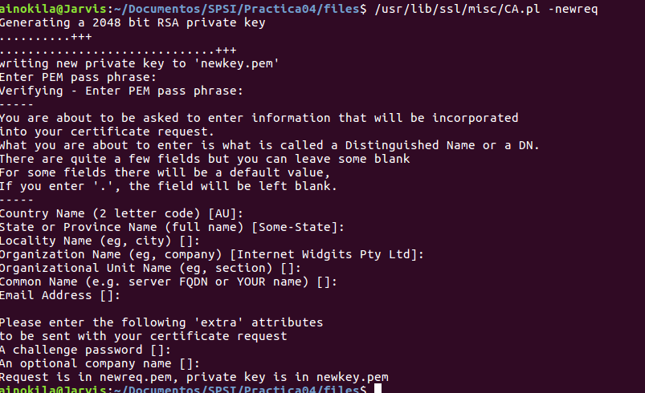

# Práctica 4

## Ejercicio 1

Cread una autoridad certicadora. En este caso se premiar a el uso de openssl ca frente a CA.pl, aun- que este u ltimo comando es admisible.

## Ejercicio 2

Cread una solicitud de certi cado que incluya la ge- neraci on de claves en la misma

## Ejercicio 3

Cread un certicado para la solicitud anterior em- pleando la CA creada en el primer punto

## Ejercicio 4
Cread una solicitud de certi cado para cualquiera de las claves que hab eis generado en las pr acticas anteriores, excepto las RSA

## Ejercicio 5

Cread un certi cado para la solicitud anterior utili- zando la CA creada.

## Ejercicio 6
Emplead las opciones -text y -noout para mostrar los valores de todos los certi cados y solicitudes de los puntos anteriores, incluyendo el certi cado ra z que habr a sido creado junto con la CA

Para generar los parametros usaré, usando primos de 128 bits:

    openssl dsaparam -out sharedDSA.pem 128

Para ver los valores, se pueden visualizar con:

    openssl dsaparam -in sharedDSA.pem -text

## Ejercicio 2

Generad dos parejas de claves para los parametros anteriores llamados nombreDSAkey.pem y apellidoDSA.key, no hace falta protegerlo por contraseña.

Para generar las claves debemos usar openssl dsaparam,

    openssl dsaparam -in sharedDSA.pem -genkey -out cristianDSAkey.pem
    openssl dsaparam -in sharedDSA.pem -genkey -out velezDSAkey.pem

## Ejercicio 3

"Extraed" la clave privada de los archivos, esta debe estar protegida por contraseña. Visualiza el contenido

    openssl dsa -in cristianDSAkey.pem -out cristianDSApriv.pem -aes128
    openssl dsa -in velezDSAkey.pem -out velezDSApriv.pem -aes128

De esta manera obtenemos la clave privada de ambos archivos, ahora si queremos visualizarla:

    openssl dsa -in cristianDSApriv.pem -text
    openssl dsa -in velezDSApriv.pem -text

Se pueden observar los parametros y su clave privada (visualizo solo cristianDSApriv.pem):

## Ejercicio 4

Extraed la clave publica de los archivos, esta no debe estar protegida por contraseña. Visualiza el contenido

Para generar la clave public usamos openssl dsa,

    openssl dsa -in cristianDSAkey.pem -out cristianDSApub.pem -pubout
    openssl dsa -in velezDSAkey.pem -out velezDSApub.pem -pubout

Para visualizarlas usaré el comando cat,

## Ejercicio 5

Calcular el valor hash del archivo nombreDSApub.pem usando sha384 con salida hexadecimal con bloques de dos caracteres separados por puntos.
Mostrad los valores por salida estandar y guardadlo en nombreDSApub.sha384

    openssl sha384 -c -hex cristianDSApub.pem

De esta manera nos muestra la salida por pantalla, para guardarlo usamos:

    openssl sha384 -c -hex -out cristianDSApub.sha384 cristianDSApub.pem

La salida de mi archivo cristianDSApub.pem es:

    SHA384(cristianDSApub.pem)= 29:df:5f:5b:02:7f:57:3d:67:7d:a1:9d:fb:d8:0e:58:b9:59:a2:3c:35:5d:f3:88:7e:1c:b5:ae:4d:d9:92:aa:8a:6d:f5:fb:ba:1b:d8:f3:bb:3b:0b:3f:c7:3a:dd:a8

## Ejercicio 6

Calcular el valor hash del archivo apellidoDSApub.pem usando una función hash de 160 bits con salida binaria. Guarda el hash en apellidoDSApub.algoritmo y muestra su contenido.

Utilizaré rmd160,

    openssl rmd160 -binary -out velezDSApub.rm160 velezDSApub.pem

Su contenido es el siguiente:

## Ejercicio 7

Generad el valor HMAC del archivo sharedDSA.pem con clave 12345 mostrandolo por pantalla.

Para generar el valor HMAC tambien necesitamos la función hash, en mi caso sha1:

    openssl dgst -sha1 -hmac '12345' sharedDSA.pem

Esto me muestra por pantalla:

    HMAC-SHA1(sharedDSA.pem)= f5e0971e799aca5a481a7513d1ab8fac5a6ccad6

## Ejercicio 8
