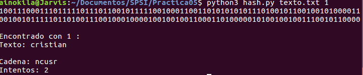
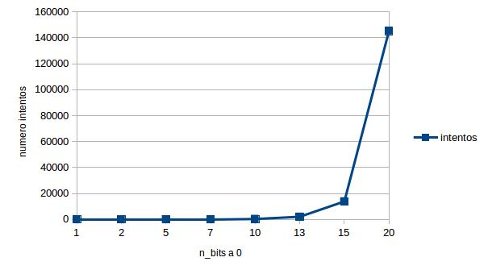
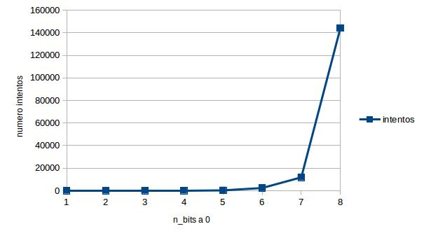
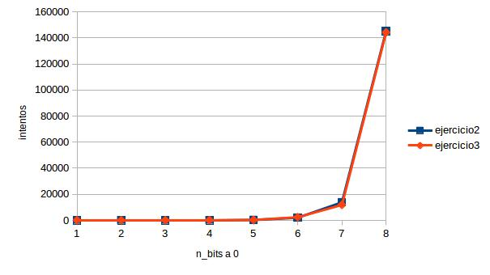

# Práctica 5

### Cristian Vélez Ruiz
### 23296392-Z
### SPSI

## Ejercicio 1

Para la funcion H, realizad, en el lenguaje de programación que queráis, una función que tome como entrada un texto y un numero de bits b. Creará un id que concatene la cadena de n bits con el texto. Pegará a ese id las cadenas aleatorias hasta conseguir que tenga los b primeros bits a 0. La salida será el id, la cadena x, el valor del hash y el numero de intentos.

    import hashlib
    import sys
    import random
    import string
    import binascii

    def generate_text_random(n):
        return "".join(random.choice(string.ascii_lowercase) for _ in range(int(n)))

    def hex_to_bin_char(char):

        if char == '0':
            return "0000"
        if char == '1':
            return "0001"
        if char == '2':
            return "0010"
        if char == '3':
            return "0011"
        if char == '4':
            return "0100"
        if char == '5':
            return "0101"
        if char == '6':
            return "0110"
        if char == '7':
            return "0111"
        if char == '8':
            return "1000"
        if char == '9':
            return "1001"
        if char == 'a':
            return "1010"
        if char == 'b':
            return "1011"
        if char == 'c':
            return "1100"
        if char == 'd':
            return "1101"
        if char == 'e':
            return "1110"
        if char == 'f':
            return "1111"

    def hex_to_bin(strin):
        sol = ""

        for i in range(len(strin)):
            sol = sol + hex_to_bin_char( strin[i])

        return sol

    def zero_first(hash,n):

        binary_string = hex_to_bin(hash)

        for i in range(int(n)):
            if binary_string[i] != '0':
                print(binary_string+"\n")
                return False

        return True

    def run(parameters):
        file = open(parameters[1],'r')
        num_bits = parameters[2]
        text = file.read()

        str_random = generate_text_random(4)
        identifier = text + str_random

        found = False
        tried = 0

        while not found:

            generated_hash = hashlib.sha1(identifier.encode('utf-8'))
            tried = tried + 1

            if zero_first(generated_hash.hexdigest(),num_bits):
                found = True
            else:
                str_random = generate_text_random(4)
                identifier = text + str_random

        if found:
            print("Encontrado con " + str(num_bits) + " :")
            print("Texto: " + text)
            print("Cadena: " + str_random)
            print("Intentos: " + str(tried))

    num_args = len(sys.argv)
    value_args = sys.argv

    if not num_args == 3:
        print("python3 hash.py <file> <n_bits>")
    else:
        run(value_args)

## Ejercicio 2

Calcula una tabla/grafica que vaya calculando el número de intentos para cada valor de b. Con el objeto de que los resultados eviten ciertos sesgos, repetir 10 veces.

Voy a realizar el experimento para b={1,2,5,7,10,13,15,20} y lo repetiré 10 veces con el script siguiente:

    for i in `seq 1 10`
    do
       python3 hash.py texto.txt $i
    done

Datos obtenidos de media para cada valor tras el sript anterior:

    1: 2 intentos
    2: 4 intentos
    5: 22 intentos
    7: 54 intentos
    10: 300 intentos
    13: 2000 intentos
    15: 13813 intentos
    20: 145237 intentos

Obtenemos la siguiente gráfica:

## Ejercicio 3

Repetid la funcion anterior pero con el siguiente cambio:
Se toma un primer valor aleatorio x y se va incrementando hasta obtener el hash requerido.

Ahora el valor 4 lo he metido en una variable y realizado los cambios:

    import hashlib
    import sys
    import random
    import string
    import binascii

    def generate_text_random(n):
        return "".join(random.choice(string.ascii_lowercase) for _ in range(int(n)))

    def hex_to_bin_char(char):

        if char == '0':
            return "0000"
        if char == '1':
            return "0001"
        if char == '2':
            return "0010"
        if char == '3':
            return "0011"
        if char == '4':
            return "0100"
        if char == '5':
            return "0101"
        if char == '6':
            return "0110"
        if char == '7':
            return "0111"
        if char == '8':
            return "1000"
        if char == '9':
            return "1001"
        if char == 'a':
            return "1010"
        if char == 'b':
            return "1011"
        if char == 'c':
            return "1100"
        if char == 'd':
            return "1101"
        if char == 'e':
            return "1110"
        if char == 'f':
            return "1111"

    def hex_to_bin(strin):
        sol = ""

        for i in range(len(strin)):
            sol = sol + hex_to_bin_char( strin[i])

        return sol

    def zero_first(hash,n):

        binary_string = hex_to_bin(hash)

        for i in range(int(n)):
            if binary_string[i] != '0':
                print(binary_string+"\n")
                return False

        return True

    def run(parameters):
        file = open(parameters[1],'r')
        num_bits = parameters[2]
        text = file.read()

        x = 4
        str_random = generate_text_random(x)
        identifier = text + str_random

        found = False
        tried = 0

        while not found:

            generated_hash = hashlib.sha1(identifier.encode('utf-8'))
            tried = tried + 1

            if zero_first(generated_hash.hexdigest(),num_bits):
                found = True
            else:
                x = x + 1
                str_random = generate_text_random(x)
                identifier = text + str_random

        if found:
            print("Encontrado con " + str(num_bits) + " :")
            print("Texto: " + text)
            print("Cadena: " + str_random)
            print("Intentos: " + str(tried))

    num_args = len(sys.argv)
    value_args = sys.argv

    if not num_args == 3:
        print("python3 hash.py <file> <n_bits>")
    else:
        run(value_args)

## Ejercicio 4

Repetid el ejercicio 2 pero con las modificaciones del ejercicio 3.

Voy a realizar el experimento para b={1,2,5,7,10,13,15,20} y lo repetiré 10 veces con el script siguiente:

    for i in `seq 1 10`
    do
       python3 hash.py texto.txt $i
    done

Datos obtenidos de media para cada valor tras el script anterior:

1: 1 intentos
2: 8 intentos
5: 35 intentos
7: 86 intentos
10: 264 intentos
13: 2376 intentos
15: 11847 intentos
20: 144274 intentos

Obtenemos la siguiente gráfica:

En este ejercicio ha disminuido un poco el número de intentos para conseguir los bits, a continuación los compararé.

Conclusión: Han disminuido el número de intentos en estas últimas ejecuciones.
